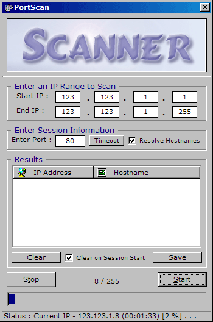



## Complete Port Scan

### Description

This scans a port on a range of IP addresses. It can resolve the hostnames of each IP it scans using the DNS ActiveX control (included). It formats the results and displays them in a listview control. This program is simple, and effecient [ I hope ;) ]. And I do not take ANY credit whatsoever for the DNS ActiveX control, it was a good control I found for free while surfing the web; although I cannot remember the name of the website I got it from; but all credit for that goes to it's author. Comments, threats, are always welcome. =)
 
### More Info
 

             |
---                |---
**Submitted On**   |2003-02-24 08:12:22
**By**             |[Daniel W\. Elkins](https://github.com/Planet-Source-Code/PSCIndex/blob/master/ByAuthor/daniel-w-elkins.md)
**Level**          |Intermediate
**User Rating**    |4.3 (26 globes from 6 users)
**Compatibility**  |VB 3\.0, VB 4\.0 \(16\-bit\), VB 4\.0 \(32\-bit\), VB 5\.0, VB 6\.0
**Category**       |[Complete Applications](https://github.com/Planet-Source-Code/PSCIndex/blob/master/ByCategory/complete-applications__1-27.md)
**World**          |[Visual Basic](https://github.com/Planet-Source-Code/PSCIndex/blob/master/ByWorld/visual-basic.md)
**Archive File**   |[Complete\_P1549672242003\.zip](https://github.com/Planet-Source-Code/daniel-w-elkins-complete-port-scan__1-43487/archive/master.zip)

